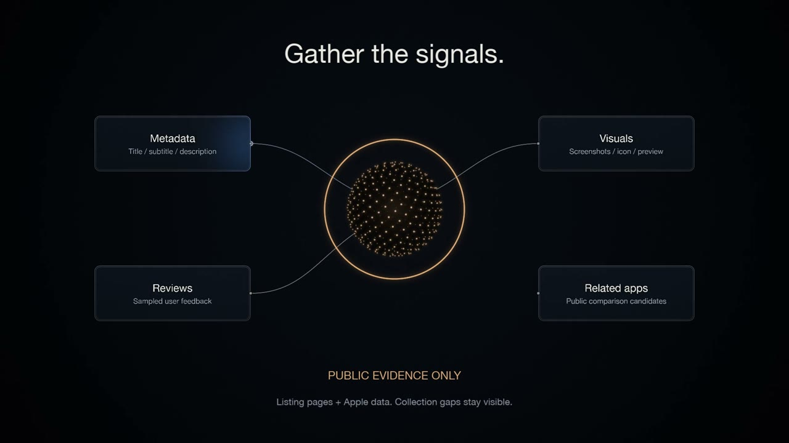

# ASO Audit Agent

A Next.js + Mastra app that runs conversational App Store Optimization audits for iOS App Store listings.

Users paste an App Store URL or numeric app ID, confirm the matched listing, and receive a structured audit with scores, recommendations, competitor context, limitations, and supporting public evidence.

## Workflow explainer

Watch how the app confirms a listing, collects public evidence, scores three branches in parallel, and produces recommendations with follow-up conversation and saved history.

[](https://raw.githubusercontent.com/yektas/aso-audit-agent/main/docs/assets/aso-audit-explainer.mp4)

[Watch the explainer](https://raw.githubusercontent.com/yektas/aso-audit-agent/main/docs/assets/aso-audit-explainer.mp4) · [Download the MP4](docs/assets/aso-audit-explainer.mp4) · [Source and rendering instructions](videos/aso-explainer/README.md) — 37.75 seconds, 7.2 MB, 1920 × 1080, 60 FPS. Silent, with on-screen explanations; the example score is illustrative.

## Setup

Requirements:

- Node.js `>=22.13.0`
- OpenAI API key
- Firecrawl API key

```bash
npm install
cp .env.example .env
```

Fill in `.env`:

```bash
AGENT_MODEL=openai/gpt-5.5
OPENAI_API_KEY=sk-...
FIRECRAWL_API_KEY=fc-fc...
```

## Run

```bash
npm run dev
```

Open [http://localhost:3000](http://localhost:3000).

## Useful Commands

```bash
npm run mastra:dev
```

`npm run mastra:dev` starts Mastra Studio using `src/mastra` as the Mastra directory and local `mastra.db` storage.

## How It Works

- `conversationAgent` handles the chat experience and invokes the ASO audit workflow when the user provides an App Store URL or app ID.
- `asoAuditWorkflow` fetches Apple metadata, suspends for listing confirmation, collects public evidence, scores the listing, and returns the final audit.
- `reportAgent` produces schema-validated scores and recommendations from supplied evidence only.
- Conversation history is stored per anonymous browser visitor so users can return to previous audit threads.

## Decisions Made

- **Workflow over tools.** The audit follows a fixed sequence with a confirmation gate in the middle, so a Mastra workflow with `suspend`/`resume` fits best.
- **Two agents.** The conversation agent handles the chat; the report agent handles scoring. Separating them keeps conversation text from bleeding into the scores.
- **9 of 10 rubric dimensions scored.** The **keyword field** is dropped because it's private app store metadata, so there was no reliable way to find these for apps.
- **App preview video scored on presence only.** Video presence is reliably detectable from public data, but I made the video analysis out of scope due to model limitations. Weight: rubric's **5%**.
- **Title carries 25%** (vs. rubric's 20%) since it has the strongest public evidence and absorbs the dropped keyword field's weight. Every other dimension stays at its rubric weight; total still sums to 100.
- **Firecrawl returns markdown + HTML.** Screenshots come from the HTML, the rest from markdown.
- **Competitor comparison is a related-search sample, not a ranking.** Apple's public API returns related apps, not ranked competitors — so the report labels them as comparison signals.
- **Every LLM call has a deterministic fallback.** On timeout or unparseable output, the audit falls back to rule-based scores. The result is lower confidence, not a broken run.
- **Anonymous sessions, no login.** Threads are stored per browser visitor via Mastra memory, so you can return to past audits without an account.
